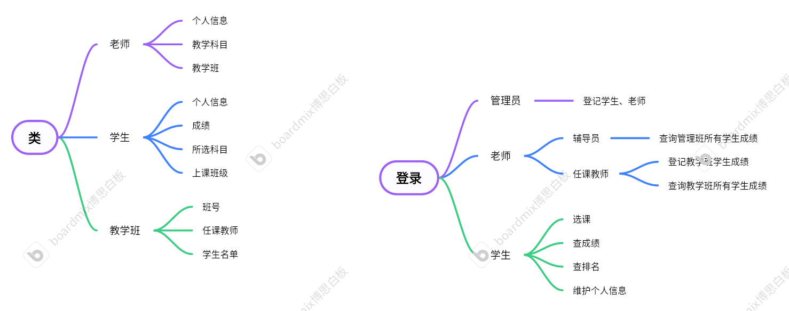
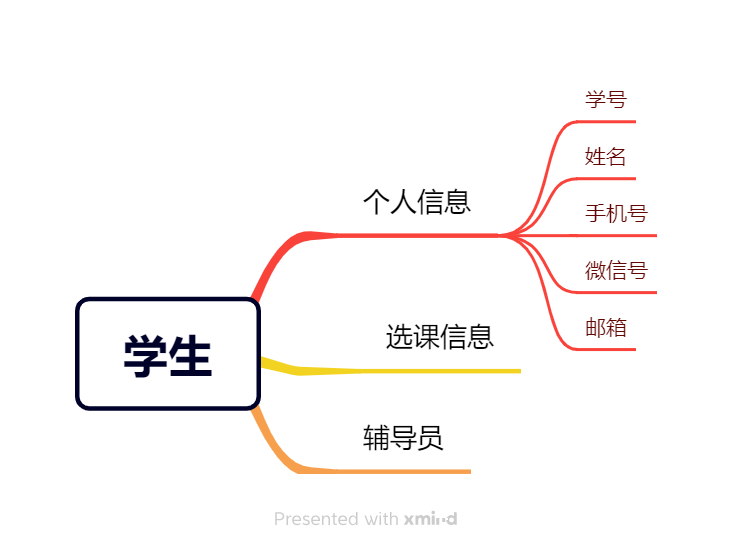
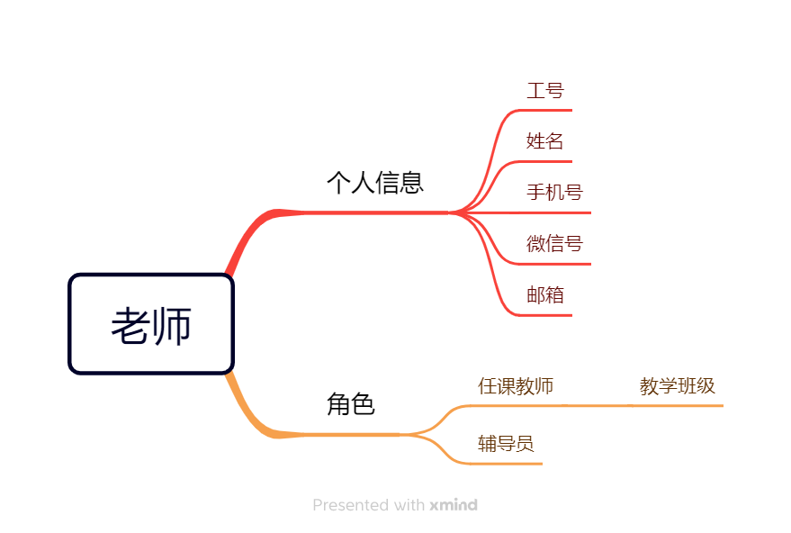
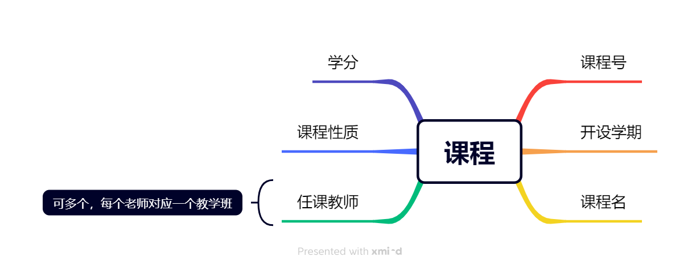
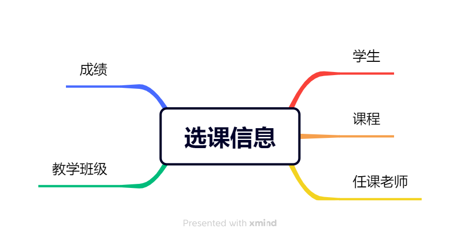
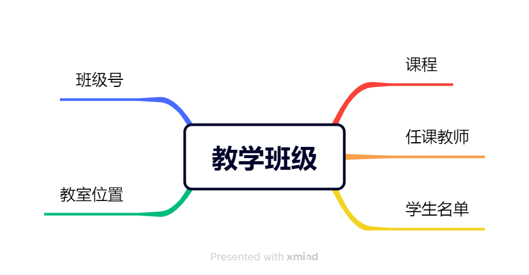

# OOD-Project
面向对象程序设计课程设计

变量命名要简洁易懂

# 前后端需要新导出的数据库：
选完课插入选课数据（已有）
老师选择教学课程（已有）
导出分配教学班（已有）
教学结束产生成绩（在选课记录表中有成绩）

# 任务列表

- [ ] 绘制系统流程图
- [ ] 完善类定义
- [ ] 构造数据库
- [ ] 后期加上学业监测系统

# System文件说明

`fronted`前端文件

`backed`后端文件

# 大体框架

# 类属性设计（一起完善）

