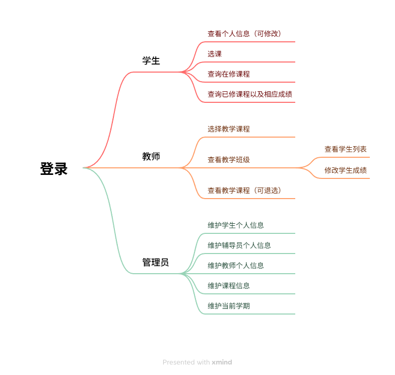
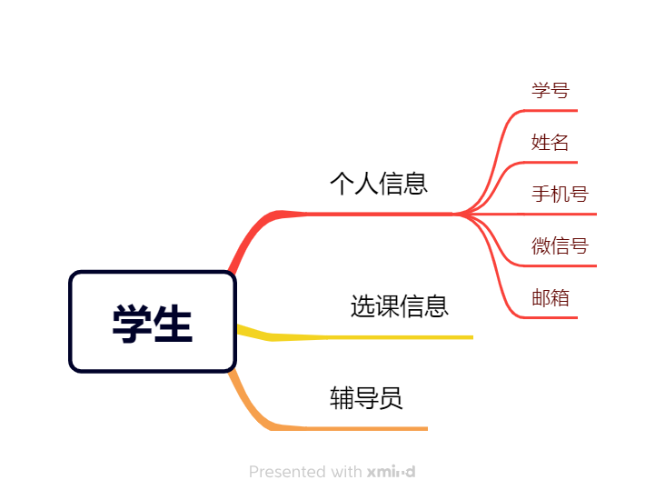
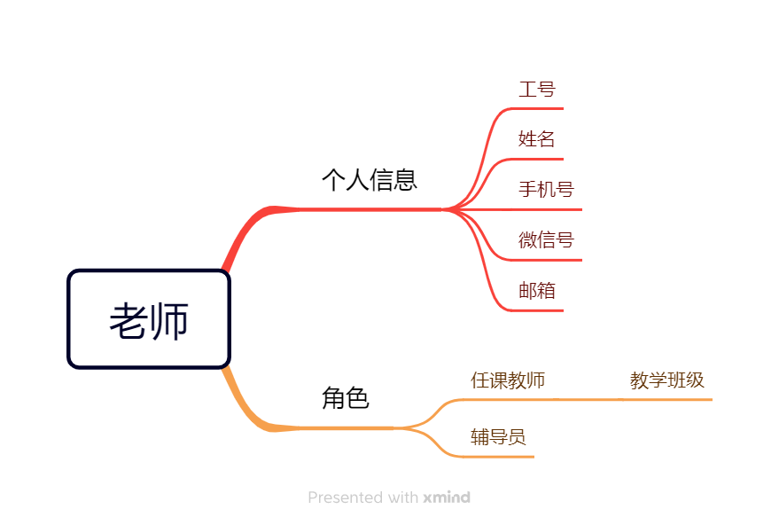
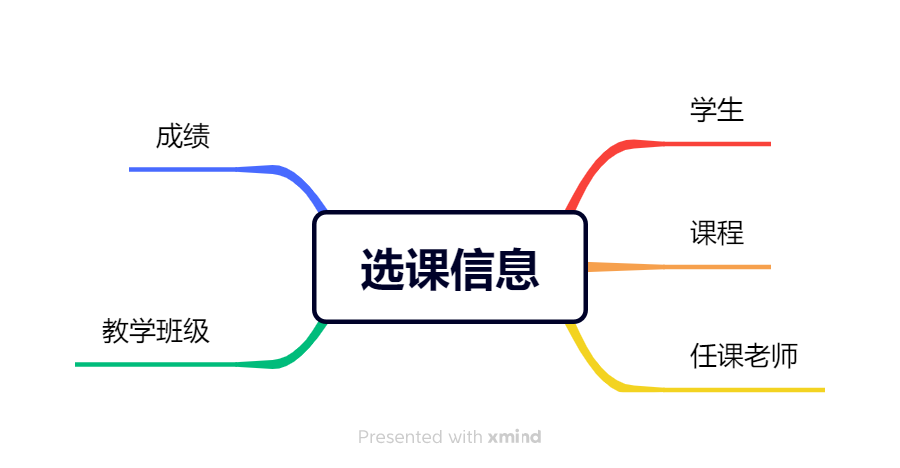
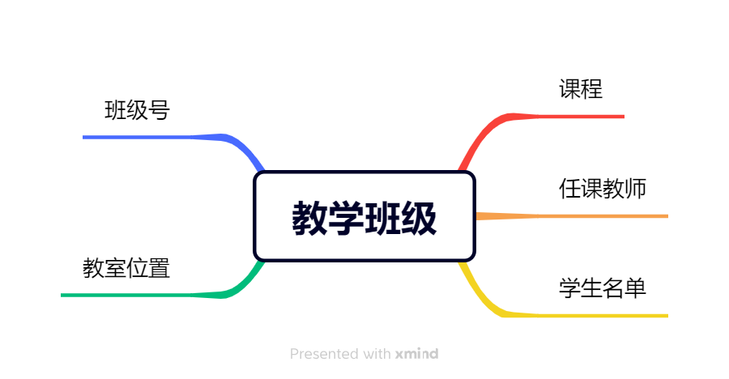

# OOD-Project
面向对象程序设计课程设计


## 前置操作

__1.启动系统前要运行`SchoolDB.sql`文件（确保使用mysql）__

__2.数据库连接密码在global.cpp文件中修改`mysql_password`的值即可__

## 样例用户（密码在数据库中已加密）

* 管理员：

```
账号：myb
密码：123456
```

* 学生

```
账号：202400000001
密码：123456
```


* 教师

```
账号：10000001
密码：123456
```


# 数据库：
数据库相关信息，请看`SchoolDB_SCHEMA.md`

# 功能模块


# 类属性设计





